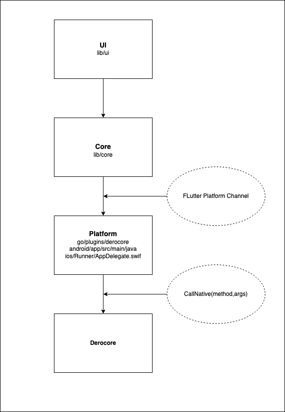

* Architecture
Dero core codebase <=> glue code (java, swift...) <=> Dart (Flutter) the UI.

In order to exchange data between core and UI, we use Protobuf due to its simplicity. The core code base export methods that flutter can call. You can find all methods definiton in folder protos. Each time you add new or modify an existing one, you should run script genprotos.sh for protobuf compiler to update new changes.
for Windows, MacOS, Linux, we use flutter-go/hover to build a cross platform binary. For mobile, we use go bind to export core code base to a lib. For faster development, you should test the app directly on PC, mobile just require a small change.
* Core
The core code base is placed in go/plugins/derocore. Derosuite already export methods through a RPC, we simply add some code to export our methods in form of protobuf.
android and ios contain glue code to call core module from java/swift and pass the data back to Flutter through platform-channel. I'm not an expert at java or swift, these code is just work. More cleaner approaches are welcome.
* UI.
To achieve responsive UI, DeroMask follow state management methodology that provided by filledstacks.com. You should read his tutorials to understand how these things work. Basically we use locator package to export data and use provider package to pass down data and change the views accordingly. Once you get the basic, it will be super easy to add/modify as your wish.